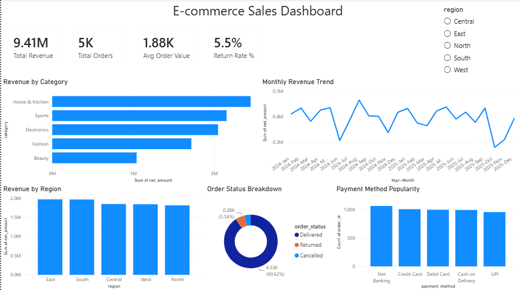

## How to Run

```bash
pip install pandas matplotlib
python analysis.py
```

This will clean the raw data, print key metrics to the console, and regenerate all charts in `images/`.

To run the SQL queries, load `data/orders_clean.csv` into a SQLite database:
```bash
sqlite3 data/sales.db
.mode csv
.import data/orders_clean.csv orders
.read sql/schema_and_queries.sql
```

## Data Cleaning Steps

- Removed exact duplicate rows
- Standardized inconsistent text (region casing, trailing whitespace in payment method)
- Filled missing `unit_price` values using category-level median (rather than dropping rows)
- Recalculated derived fields (`gross_amount`, `discount_amount`, `net_amount`) after cleaning to keep totals consistent
- Excluded cancelled orders from revenue calculations (documented business rule)

## Key Findings

- **Total Revenue:** ₹90.5L across 4,808 completed orders
- **Average Order Value:** ₹1,883
- **Return Rate:** 5.5% of all orders
- **Top Category:** Home & Kitchen
- **Top Region:** East

### Monthly Revenue Trend


Revenue shows a seasonal spike around October–November, consistent with festive/holiday shopping behavior built into the discount patterns.

### Revenue by Category


### Revenue by Region


### Order Status Breakdown


### Payment Method Popularity


## Interactive Power BI Dashboard

Built an interactive Power BI dashboard on top of `orders_clean.csv`, with a region slicer that filters all visuals simultaneously.



**Included visuals:**
- KPI cards: Total Revenue, Total Orders, Avg Order Value, Return Rate %
- Revenue by Category (bar chart)
- Monthly Revenue Trend (Jan 2024 – Dec 2025, line chart)
- Revenue by Region (column chart)
- Order Status Breakdown (donut chart)
- Payment Method Popularity (bar chart)
- Region slicer for interactive filtering across all visuals

The `.pbix` file (`ecommerce_dashboard.pbix`) is included in this repo — open it in Power BI Desktop to explore the dashboard interactively.

## SQL Highlights

The `sql/schema_and_queries.sql` file includes 10 business questions, ranging from simple aggregations to window functions:
- Monthly revenue & order count
- Revenue and return rate by category
- Top 10 customers by lifetime spend
- Month-over-month revenue growth using `LAG()`
- Product ranking within category using `RANK()`
- Churn-risk customers (no orders in 90+ days)

## Possible Next Steps

- Add a customer segmentation model (RFM analysis)
- Forecast next quarter's revenue using time series methods

---
*Note: Dataset is synthetically generated for portfolio/demonstration purposes and does not represent a real business.*
