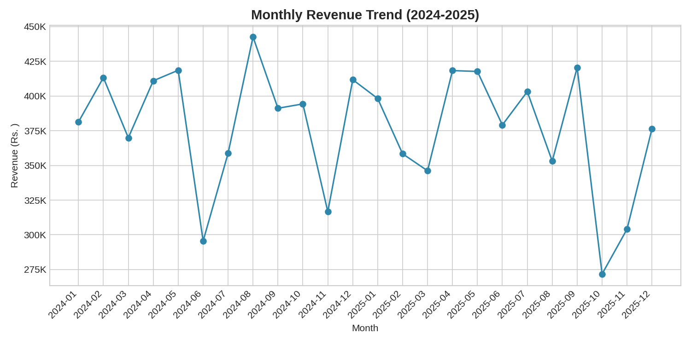
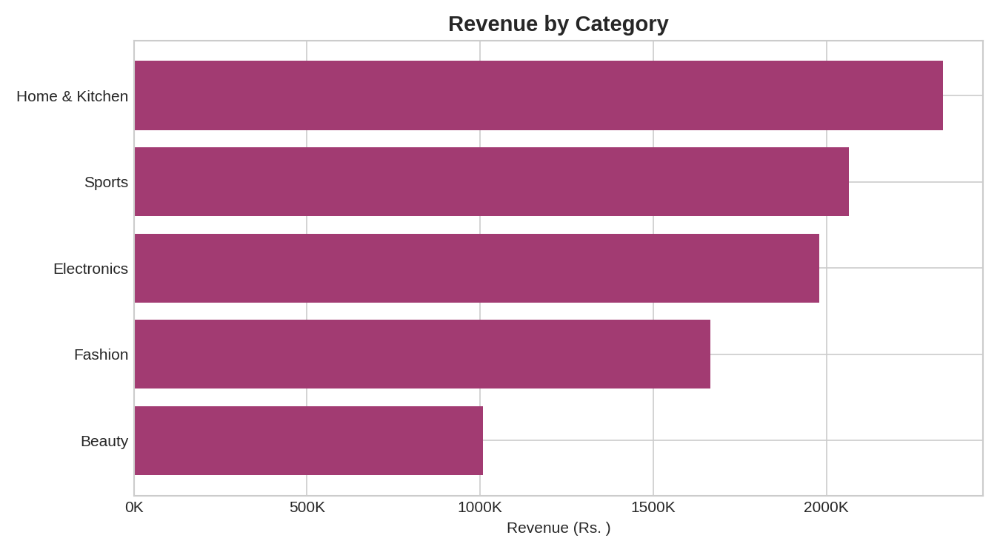
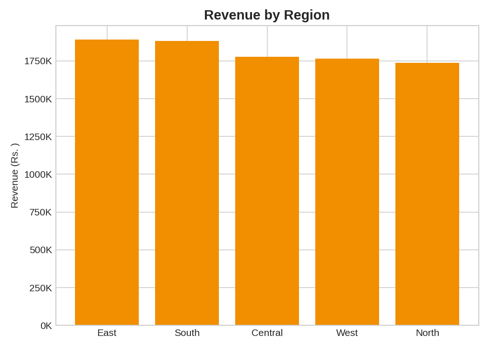
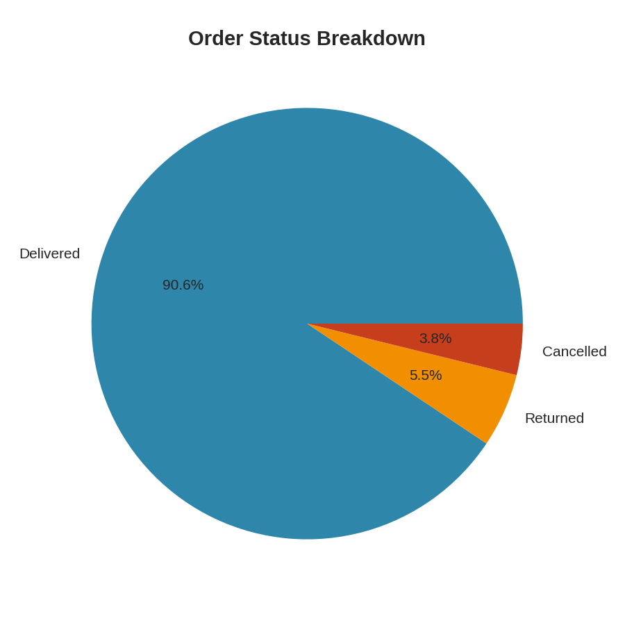
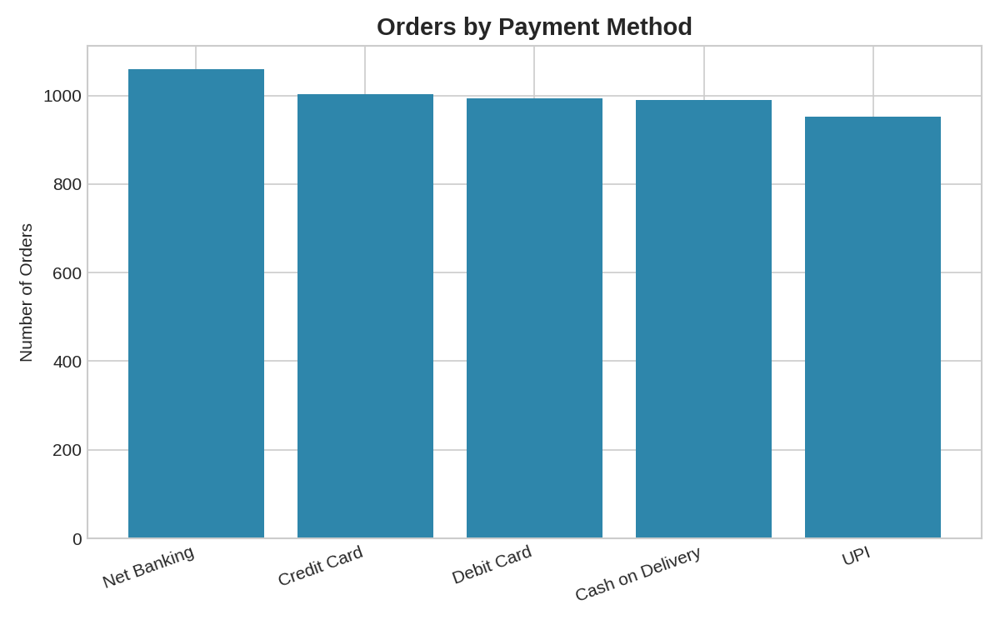

# E-commerce Sales Analysis

Analysis of ~5,000 e-commerce orders (2024–2025) to uncover revenue trends, top-performing categories/regions, customer behavior, and return patterns — built using **Python (Pandas)** for cleaning/analysis and **SQL** for business-question queries.

## Problem Statement

An online retailer wants to understand:
- Where revenue is coming from (categories, regions, customers)
- Whether sales are growing month-over-month
- Which products get returned most, and why that might matter
- How discounts affect purchase quantity

This project answers those questions end-to-end: raw data → cleaning → analysis → SQL insights → visualizations.

## Tech Stack

- **Python**: pandas, matplotlib
- **SQL**: SQLite (queries are portable to PostgreSQL/MySQL with minor tweaks)
- **Data**: synthetic dataset modeled on realistic e-commerce order data (intentionally includes missing values, inconsistent text casing, and duplicates to demonstrate data cleaning)

## Project Structure

```
ecommerce-sales-analysis/
├── data/
│   ├── orders.csv           # raw data (with intentional data quality issues)
│   └── orders_clean.csv     # cleaned data (output of analysis.py)
├── sql/
│   └── schema_and_queries.sql   # table schema + 10 business-question queries
├── images/                  # generated charts
├── analysis.py              # cleaning + analysis + chart generation
└── README.md
```

## How to Run

```bash
pip install pandas matplotlib
python analysis.py
```

This will clean the raw data, print key metrics to the console, and regenerate all charts in `images/`.

To run the SQL queries, load `data/orders_clean.csv` into a SQLite database:
```bash
sqlite3 data/sales.db
.mode csv
.import data/orders_clean.csv orders
.read sql/schema_and_queries.sql
```

## Data Cleaning Steps

- Removed exact duplicate rows
- Standardized inconsistent text (region casing, trailing whitespace in payment method)
- Filled missing `unit_price` values using category-level median (rather than dropping rows)
- Recalculated derived fields (`gross_amount`, `discount_amount`, `net_amount`) after cleaning to keep totals consistent
- Excluded cancelled orders from revenue calculations (documented business rule)

## Key Findings

- **Total Revenue:** ₹90.5L across 4,808 completed orders
- **Average Order Value:** ₹1,883
- **Return Rate:** 5.5% of all orders
- **Top Category:** Home & Kitchen
- **Top Region:** East

### Monthly Revenue Trend


Revenue shows a seasonal spike around October–November, consistent with festive/holiday shopping behavior built into the discount patterns.

### Revenue by Category


### Revenue by Region


### Order Status Breakdown


### Payment Method Popularity


## SQL Highlights

The `sql/schema_and_queries.sql` file includes 10 business questions, ranging from simple aggregations to window functions:
- Monthly revenue & order count
- Revenue and return rate by category
- Top 10 customers by lifetime spend
- Month-over-month revenue growth using `LAG()`
- Product ranking within category using `RANK()`
- Churn-risk customers (no orders in 90+ days)

## Possible Next Steps

- Build an interactive Power BI / Tableau dashboard on top of `orders_clean.csv`
- Add a customer segmentation model (RFM analysis)
- Forecast next quarter's revenue using time series methods

---
*Note: Dataset is synthetically generated for portfolio/demonstration purposes and does not represent a real business.*
